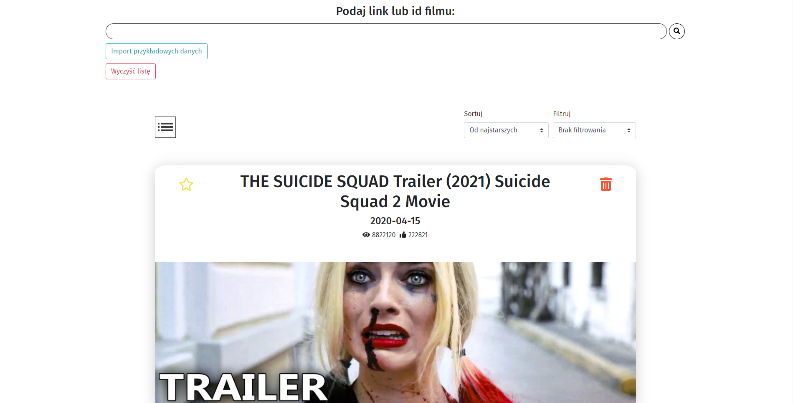

# Video App

It's an easy and quick to use website which allows users to store their favourite youtube films ( in future more sites will be available ). The user just has to put a link to the video and then the film is stored in user Local Storage. The app also allows user to sort and filter a list of films.

## Live Link

https://pawior.github.io/video-app/

## Table of contents

- [Features](#features)
- [Preview](#preview)
- [Languages](#languages)
- [Contributing](#contributing)
- [License](#license)

## Features

- The app shows film statistics - views, like, title, thumbnail.
- Local Storage ( data are stored even after closing the page )
- Add films to favourite list and filtering by favourite
- Sorting by newest/oldest/alphabetically
- Hardcoded data if you'd like to test the app
- Modern web design
- Support all youtube links type ( shorten, with channel name, etc. )

## Preview

## Languages

Project is created with:

### React

- [React](https://reactjs.org/)

### Redux

- [Redux](https://redux.js.org/)

### Styled Components and SCSS

- [Styled Components](https://styled-components.com/)
- [SCSS](https://sass-lang.com/)

## Contributing

Pull requests are welcome. For major changes, please open an issue first to discuss what you would like to change.

## License

[MIT](https://choosealicense.com/licenses/mit/)
