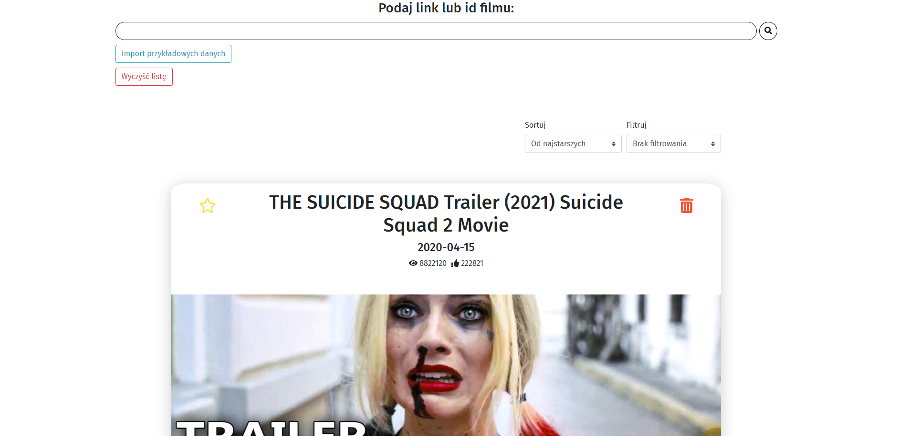
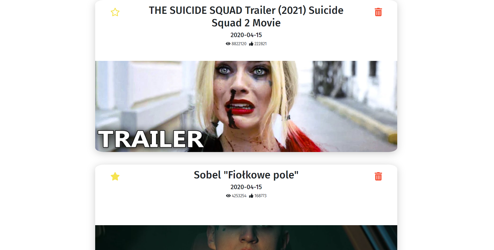

# Video App

Easy and fast to use webiste which allow users to store their youtube films. User just put link or film id then film is stored in user Local Storage. App allow user to sorting and filtering films list.

## Table of contents
* [Features](#features)
* [Preview](#preview)
* [Languages & tools](#languages&tools)
* [Sources](#sources)
* [Contributing] (#contributing)
* [License] (#license)

## Features
* App show film statistics - views, like, title, thumbnail.
* Local Storage ( data are stored even after closing the page )
* Add film to favourite list and filtering by favourite
* Sorting by newest/oldest/alphabetically
* Hardocoded data if you'd like to test app
* Modern and clear design
* Support all youtube links type ( shorten, with channel name, etc. )

## Preview

## Languages & tools
Project is created with:

### React
- [React](https://reactjs.org/)

### Redux

- [Redux](https://redux.js.org/)

### Styled Components and SCSS

- [Styled Components](https://styled-components.com/)
- [SCSS](https://sass-lang.com/)

## Contributing
Pull requests are welcome. For major changes, please open an issue first to discuss what you would like to change.

## License
[MIT](https://choosealicense.com/licenses/mit/)
